# DATABASE_ERD — Diagrama Entidad-Relación (modelo conceptual)

| Campo | Valor |
|---|---|
| Documento | `docs/architecture/DATABASE_ERD.md` |
| Identificador propuesto | `DB-002` (acompaña a `DB-001` / `DATABASE_ARCHITECTURE.md`) — **pendiente de ratificación** |
| Versión | 0.9 |
| Estado | **Borrador — representa solo el modelo conceptual ratificado hasta hoy** |
| Depende de | `DATABASE_ARCHITECTURE.md` (fuente de verdad directa), `HB-001`, `REPOSITORY_STRUCTURE.md` |
| Idioma | Español (documentación oficial), identificadores/código en inglés |

>  **Este ERD NO es el esquema de PostgreSQL.** Representa el **modelo conceptual aprobado hasta este momento**, no un esquema implementado 1:1 (aunque en esta versión coincide con él, ver nota v0.3). Las entidades ratificadas hoy son `users`, `posts`, `likes`, `comments`, `follows`, `notifications`, `password_reset_tokens` y `email_verification_tokens` (`DATABASE_ARCHITECTURE.md` §5). No se implementan tablas, migraciones ni dependencias desde este documento.
>
> **v0.9 — decimoprimera y decimosegunda relación del modelo (`ADR-009-password-reset-and-email-verification.md`).** `password_reset_tokens`/`email_verification_tokens` pasan de candidata objetivo ("Verificación de correo, Recuperación de contraseña", `PENDIENTE DE DECISIÓN`) a ratificadas (`DATABASE_ARCHITECTURE.md` §4.A/§5.7/§5.8, v0.13) — se agregan al diagrama (§3) junto con `USERS ||--o{ PASSWORD_RESET_TOKENS` y `USERS ||--o{ EMAIL_VERIFICATION_TOKENS`. `users` gana la columna `email_verified`. Reflejado en §3, §4, §5, §6, §7, §8.
>
> **v0.8 — octava, novena y décima relación del modelo (`ADR-008-notifications-minimal-model.md`).** `notifications` pasa de candidata objetivo (§8, solo para los tipos `like`/`comment`/`follow`) a ratificada (`DATABASE_ARCHITECTURE.md` §4.A/§5.6, v0.12) — se agrega al diagrama (§3) junto con las relaciones `USERS ||--o{ NOTIFICATIONS` (dos veces: como destinatario y como actor) y `POSTS ||--o{ NOTIFICATIONS`. Reflejado en §3, §4, §5, §6, §7, §8.
>
> **v0.7 — sexta y séptima relación del modelo, primera auto-referencial (`ADR-007-follows-minimal-model.md`).** `follows` pasa de candidata objetivo ("Seguir, Dejar de seguir, Seguidores, Seguidos") a ratificada (`DATABASE_ARCHITECTURE.md` §4.A/§5.5, v0.11) — se agrega al diagrama (§3) junto con las relaciones `USERS ||--o{ FOLLOWS` (dos veces: como quien sigue y como quien es seguido). `followers_count`/`following_count` de `users` y `is_followed_by_me` de `posts.author` son **calculados**, no columnas propias — no se dibujan como atributos de `USERS`/`POSTS` en el diagrama (regla de "solo columnas reales de la tabla"). Reflejado en §3, §4, §5, §6, §7, §8.
>
> **v0.6 — cuarta y quinta relación del modelo (`ADR-006-comments-minimal-model.md`).** `comments` pasa de candidata objetivo (mitad plana de "Comentarios + Respuestas") a ratificada (`DATABASE_ARCHITECTURE.md` §4.A/§5.4, v0.10) — se agrega al diagrama (§3) junto con las relaciones `users ||--o{ comments` y `posts ||--o{ comments`. Reflejado en §3, §4, §5, §6, §7, §8.
>
> **v0.5 — primera tabla puente N:N del modelo (`ADR-005-likes-minimal-model.md`).** `likes` pasa de candidata objetivo (`reactions`, caso binario) a ratificada (`DATABASE_ARCHITECTURE.md` §4.A/§5.3, v0.9) — se agrega al diagrama (§3) junto con la segunda y tercera relación que este ERD dibuja (`users ||--o{ likes`, `posts ||--o{ likes`). Reflejado en §3, §4, §5, §6, §7, §8.
>
> **v0.4 — primera relación real del modelo (`ADR-004-posts-minimal-model.md`).** `posts` pasa de candidata objetivo a ratificada (`DATABASE_ARCHITECTURE.md` §4.A/§5.2, v0.8) — se agrega al diagrama (§3) junto con la primera relación entre entidades que este ERD dibuja (`users ||--o{ posts`). Reflejado en §3, §4, §5, §6, §7, §8.
>
> **v0.3 — auditoría documental integral de THERS (sincronización, sin cambios de esquema).** Este ERD seguía dibujando solo las 5 columnas de la migración inicial (`id`, `name`, `email`, `password_hash`, `created_at`/`updated_at`), sin `username`/`phone`/`country_code`/`birth_date` (ratificadas por `ADR-002-user-profile-fields.md`, `DATABASE_ARCHITECTURE.md` v0.5) ni `username_changed_at` (ratificada por `ADR-003-profile-update-contract.md`, `DATABASE_ARCHITECTURE.md` v0.6) — quedó desactualizado dos ratificaciones por detrás de su propia fuente de verdad (§2 de este documento). La "contradicción detectada" que §8 registraba (username/teléfono confirmados en el alcance funcional pero no dibujados) ya no aplica: `username`/`phone`/`country_code`/`birth_date` migraron de candidatos a ratificados: se corrige el diagrama (§3) y §7/§8 más abajo. `avatar_url`/`bio` siguen sin ratificar y **no** se agregan aquí.

---

## 1. Propósito del ERD

Representar visualmente el modelo conceptual de datos de THERS **ratificado hasta hoy**, para que sirva de referencia compartida antes de implementar PostgreSQL. Su alcance es deliberadamente conservador: dibuja únicamente lo que ya tiene una decisión de persistencia registrada, y deja explícito —sin inventarlo— todo lo que aún debe ratificarse.

---

## 2. Fuente de verdad utilizada

En orden de prioridad para este documento:

1. **`docs/architecture/DATABASE_ARCHITECTURE.md`** — fuente de verdad directa del modelo de datos. Ratifica **una sola entidad** (`users`, §5) y lista el resto como PENDIENTE (§14).
2. **Backend real** (`backend/app/…`) — solo existe el flujo de autenticación (`POST /api/login`) con validación temporal; **no hay modelos ni persistencia**.
3. **Documentación oficial** (`HB-001`, `REPOSITORY_STRUCTURE.md`) — stack (PostgreSQL) y gobernanza (ADR para decisiones de impacto medio/alto).

> El **alcance funcional confirmado por el equipo** (autenticación, perfil, configuración, contenido, interacciones, relaciones sociales, mensajería, notificaciones, seguridad) se toma como **roadmap de producto**, no como modelo de datos ratificado. Ver §8 y la contradicción registrada más abajo.

---

## 3. Diagrama ER (Mermaid)

Solo se dibuja la entidad ratificada. No se dibujan entidades ni relaciones especulativas (reglas 1–4 de esta tarea).

```mermaid
erDiagram
    USERS {
        uuid id PK "DEFAULT gen_random_uuid() — generado en PostgreSQL"
        varchar_120 name "NOT NULL"
        varchar_30 username UK "NOT NULL — case-sensitive (ADR-002)"
        citext email UK "NOT NULL — case-insensitive, identificador de login"
        varchar_20 phone "NOT NULL — junto con country_code (ADR-002)"
        varchar_6 country_code "NOT NULL (ADR-002)"
        date birth_date "NOT NULL — edad mínima 13 años (ADR-002)"
        text password_hash "NOT NULL — nunca en claro"
        timestamptz username_changed_at "NULLABLE — soporta cooldown de 30 días (ADR-003), nunca expuesta en la API"
        boolean email_verified "NOT NULL, DEFAULT false (ADR-009)"
        timestamptz created_at "NOT NULL, DEFAULT now()"
        timestamptz updated_at "NOT NULL, DEFAULT now(), mantenida por trigger"
    }

    POSTS {
        uuid id PK "DEFAULT gen_random_uuid() — generado en PostgreSQL"
        uuid author_id FK "NOT NULL — ON DELETE CASCADE (ADR-004)"
        text content "NOT NULL — máximo 2000 caracteres (validado en la aplicación)"
        timestamptz created_at "NOT NULL, DEFAULT now() — define el orden del feed"
        timestamptz updated_at "NOT NULL, DEFAULT now(), mantenida por trigger — sin uso funcional aún (sin edición de posts)"
    }

    LIKES {
        uuid id PK "DEFAULT gen_random_uuid() — generado en PostgreSQL"
        uuid post_id FK "NOT NULL — ON DELETE CASCADE (ADR-005)"
        uuid user_id FK "NOT NULL — ON DELETE CASCADE (ADR-005)"
        timestamptz created_at "NOT NULL, DEFAULT now()"
    }

    COMMENTS {
        uuid id PK "DEFAULT gen_random_uuid() — generado en PostgreSQL"
        uuid post_id FK "NOT NULL — ON DELETE CASCADE (ADR-006)"
        uuid author_id FK "NOT NULL — ON DELETE CASCADE (ADR-006)"
        text content "NOT NULL — máximo 1000 caracteres (validado en la aplicación)"
        timestamptz created_at "NOT NULL, DEFAULT now() — define el orden del hilo (ascendente)"
        timestamptz updated_at "NOT NULL, DEFAULT now(), mantenida por trigger — sin uso funcional aún (sin edición de comentarios)"
    }

    FOLLOWS {
        uuid id PK "DEFAULT gen_random_uuid() — generado en PostgreSQL"
        uuid follower_id FK "NOT NULL — ON DELETE CASCADE (ADR-007)"
        uuid followed_id FK "NOT NULL — ON DELETE CASCADE (ADR-007)"
        timestamptz created_at "NOT NULL, DEFAULT now()"
    }

    NOTIFICATIONS {
        uuid id PK "DEFAULT gen_random_uuid() — generado en PostgreSQL"
        uuid recipient_id FK "NOT NULL — ON DELETE CASCADE (ADR-008)"
        uuid actor_id FK "NOT NULL — ON DELETE CASCADE (ADR-008)"
        varchar_20 type "NOT NULL — discriminador: like/comment/follow (ADR-008)"
        uuid post_id FK "NULLABLE — solo like/comment, ON DELETE CASCADE (ADR-008)"
        timestamptz read_at "NULLABLE — NULL = no leída, nunca expuesta cruda en la API"
        timestamptz created_at "NOT NULL, DEFAULT now()"
    }

    PASSWORD_RESET_TOKENS {
        uuid id PK "DEFAULT gen_random_uuid() — generado en PostgreSQL"
        uuid user_id FK "NOT NULL — ON DELETE CASCADE (ADR-009)"
        varchar_64 token_hash UK "NOT NULL — SHA-256 del token crudo, nunca el valor en claro"
        timestamptz expires_at "NOT NULL — 30 minutos desde su creación"
        timestamptz used_at "NULLABLE — NULL = no usado, un solo uso"
        timestamptz created_at "NOT NULL, DEFAULT now()"
    }

    EMAIL_VERIFICATION_TOKENS {
        uuid id PK "DEFAULT gen_random_uuid() — generado en PostgreSQL"
        uuid user_id FK "NOT NULL — ON DELETE CASCADE (ADR-009)"
        varchar_64 token_hash UK "NOT NULL — SHA-256 del token crudo, nunca el valor en claro"
        timestamptz expires_at "NOT NULL — 24 horas desde su creación"
        timestamptz used_at "NULLABLE — NULL = no usado, un solo uso"
        timestamptz created_at "NOT NULL, DEFAULT now()"
    }

    USERS ||--o{ POSTS : "publica"
    USERS ||--o{ LIKES : "da like"
    POSTS ||--o{ LIKES : "recibe like"
    USERS ||--o{ COMMENTS : "comenta"
    POSTS ||--o{ COMMENTS : "recibe comentario"
    USERS ||--o{ FOLLOWS : "sigue"
    USERS ||--o{ FOLLOWS : "es seguido"
    USERS ||--o{ NOTIFICATIONS : "recibe"
    USERS ||--o{ NOTIFICATIONS : "genera"
    POSTS ||--o{ NOTIFICATIONS : "origina"
    USERS ||--o{ PASSWORD_RESET_TOKENS : "solicita"
    USERS ||--o{ EMAIL_VERIFICATION_TOKENS : "solicita"
```

> **Nota sobre el tipo de `id`:** UUID con `DEFAULT gen_random_uuid()` a nivel de PostgreSQL (función nativa desde PostgreSQL 13, sin extensión adicional), implementado en `backend/app/infrastructure/persistence/models.py` y en la migración `a1b2c3d4e5f6_create_users_table.py` (`DATABASE_ARCHITECTURE.md` §5). **Ratificación formal por el Comité Técnico pendiente de confirmar** (`HB-001` §11.1) — decisión indicada directamente por el Tech Lead Backend.
>
> **Nota sobre `username`/`phone`/`country_code`/`birth_date` (v0.3, `ADR-002-user-profile-fields.md`):** `username` es **case-sensitive** (a diferencia de `email`) — decisión explícita, ningún flujo hoy requiere comparación case-insensitive. `phone`/`country_code` representan un único dato lógico (teléfono internacional) y no llevan constraint de unicidad. `birth_date` se valida con edad mínima de 13 años en el backend (`domain/auth/validators.py`).
>
> **Nota sobre `email`:** tipo `CITEXT` (extensión `citext` de PostgreSQL, creada por la propia migración) — el `UNIQUE` es case-insensitive a nivel de motor.
>
> **Nota sobre `username_changed_at` (v0.3, `ADR-003-profile-update-contract.md`):** sostiene el cooldown de 30 días entre cambios de `username` vía `PATCH /api/users/me` (`domain/auth/username_policy.py`). `NULL` significa "nunca cambió su username". Es un dato **interno** — nunca cruza la frontera HTTP (`API_CONTRACT.md` §5), por eso no se expone junto a las demás columnas en ningún endpoint público.
>
> **Nota sobre `updated_at`:** actualizada por un trigger de PostgreSQL (`set_updated_at`/`trg_users_updated_at`), no por la capa de aplicación — se mantiene correcta incluso ante `UPDATE`s hechos por SQL directo.
>
> **Nota sobre `POSTS` (v0.4, `ADR-004-posts-minimal-model.md`):** primera entidad y primera relación (`users ||--o{ posts`, "publica") que este ERD dibuja más allá de `users`. Deliberadamente mínima — sin `visibility`, `mood`, hashtags, medios, reacciones ni comentarios; cada uno es su propia entidad candidata (§8) a resolver en un ADR futuro y acotado. `author_id` reutiliza la función `set_updated_at()` ya creada por la migración inicial de `users` — no se duplica.
>
> **Nota sobre `LIKES` (v0.5, `ADR-005-likes-minimal-model.md`):** primera tabla puente N:N que este ERD dibuja (`users ||--o{ likes`, `posts ||--o{ likes`) — resuelve solo el caso binario like/no-like de la candidata `reactions` (§8); tipos de reacción siguen sin ratificar. Sin `updated_at`: un like no se edita in place. `UNIQUE (post_id, user_id)` (no representable con el marcador `UK` de Mermaid sobre una sola columna — ver `DATABASE_ARCHITECTURE.md` §5.3 para el detalle exacto de la constraint compuesta).
>
> **Nota sobre `COMMENTS` (v0.6, `ADR-006-comments-minimal-model.md`):** resuelve solo la mitad plana de la candidata combinada "Comentarios + Respuestas" (§8) — sin `parent_comment_id`, sin hilos. `created_at` define orden **ascendente** (más antiguo primero), a diferencia de `POSTS` que va al revés. `updated_at`+trigger siguen la misma convención de auditoría que `POSTS`, aunque tampoco hay edición todavía.
>
> **Nota sobre `FOLLOWS` (v0.7, `ADR-007-follows-minimal-model.md`):** primera relación auto-referencial (`users`↔`users`) que este ERD dibuja — por eso `USERS ||--o{ FOLLOWS` aparece dos veces, una por cada lado de la relación ("sigue"/"es seguido"). Sin `updated_at`, mismo criterio que `LIKES`. `UNIQUE (follower_id, followed_id)` (mismo caso que `LIKES`, no representable con `UK` de Mermaid sobre una sola columna) más una **`CHECK (follower_id <> followed_id)`** — primera restricción `CHECK` del esquema, tampoco representable en la notación de Mermaid, ver `DATABASE_ARCHITECTURE.md` §5.5 para el detalle exacto. `followers_count`/`following_count` de `USERS` e `is_followed_by_me` de `posts.author` (`API_CONTRACT.md`) son **calculados** a partir de `FOLLOWS`, no columnas propias — no se dibujan como atributos de ninguna entidad.
>
> **Nota sobre `NOTIFICATIONS` (v0.8, `ADR-008-notifications-minimal-model.md`):** primera entidad que este ERD dibuja con **dos** relaciones distintas hacia `USERS` en roles distintos (`recipient_id`/"recibe" y `actor_id`/"genera", ambas `ON DELETE CASCADE`) más una tercera hacia `POSTS` (`post_id`, nullable — solo aplica a `like`/`comment`, `NULL` en `follow`). Sin `updated_at`, mismo criterio que `LIKES`/`FOLLOWS`: se crea o se marca leída (`read_at`), nunca se edita de otro modo. **Sin `UNIQUE`** — a diferencia de `LIKES`/`FOLLOWS`, dos notificaciones del mismo tipo/actor/post en momentos distintos son eventos legítimos, no un duplicado a impedir (`DATABASE_ARCHITECTURE.md` §5.6). Cubre solo los tipos `like`/`comment`/`follow` — respuestas, menciones y mensajes siguen como candidatas (§8), dependientes de entidades que todavía no existen.
>
> **Nota sobre `email_verified` en `USERS` y sobre `PASSWORD_RESET_TOKENS`/`EMAIL_VERIFICATION_TOKENS` (v0.9, `ADR-009-password-reset-and-email-verification.md`):** `email_verified` es la primera columna nueva que `USERS` gana desde `username_changed_at` (v0.3) — `DEFAULT false`, sin backfill posible para cuentas previas. Las dos tablas de tokens tienen exactamente la misma forma (`token_hash` con `UNIQUE`, no representable con el marcador `UK` de Mermaid sobre una constraint compuesta pero acá sí es una columna simple; `expires_at`; `used_at` nullable = no usado; sin `updated_at`, mismo criterio que `LIKES`/`FOLLOWS`) — se mantienen como dos entidades separadas, no una genérica, porque su TTL (30 minutos vs. 24 horas) y su política al consumirse (`password_reset_tokens` invalida otros tokens pendientes del mismo usuario, `email_verification_tokens` no) difieren (`DATABASE_ARCHITECTURE.md` §5.7/§5.8). El valor **crudo** del token nunca se dibuja como columna — solo su hash SHA-256, el mismo que se persiste.

---

## 4. Leyenda de relaciones

Notación de cardinalidad de Mermaid `erDiagram`, para lectura futura cuando existan más entidades:

| Símbolo | Significado |
|---|---|
| `||--||` | uno y solo uno ↔ uno y solo uno |
| `||--o{` | uno ↔ cero o muchos |
| `}o--o{` | cero o muchos ↔ cero o muchos (relación N:N, requiere tabla puente) |
| `||--|{` | uno ↔ uno o muchos |

| Marcador de atributo | Significado |
|---|---|
| `PK` | Clave primaria |
| `FK` | Clave foránea |
| `UK` | Clave única (unicidad a nivel de esquema) |

> **v0.4 — primera relación dibujada:** `USERS ||--o{ POSTS` ("uno ↔ cero o muchos") — un usuario puede tener cero o muchos posts; cada post tiene exactamente un autor.
>
> **v0.5 — segunda y tercera relación dibujadas:** `USERS ||--o{ LIKES` y `POSTS ||--o{ LIKES` — `likes` es la primera tabla puente N:N real de este ERD: un usuario puede dar muchos likes, un post puede recibir muchos likes, y cada like conecta exactamente un usuario con exactamente un post (la `UNIQUE (post_id, user_id)` impide que se repita el mismo par).
>
> **v0.6 — cuarta y quinta relación dibujadas:** `USERS ||--o{ COMMENTS` y `POSTS ||--o{ COMMENTS` — un usuario puede escribir muchos comentarios, un post puede recibir muchos comentarios; cada comentario tiene exactamente un autor y un post.
>
> **v0.7 — sexta y séptima relación dibujadas, primera auto-referencial:** `USERS ||--o{ FOLLOWS` (dos veces) — un usuario puede seguir a muchos usuarios y ser seguido por muchos usuarios; cada fila de `FOLLOWS` conecta exactamente dos usuarios distintos (`CHECK ck_follows_no_self_follow`). La leyenda se mantiene para cuando el modelo siga creciendo.
>
> **v0.8 — octava, novena y décima relación dibujadas:** `USERS ||--o{ NOTIFICATIONS` (dos veces, "recibe"/"genera") y `POSTS ||--o{ NOTIFICATIONS` ("origina") — un usuario puede recibir muchas notificaciones y generar muchas (con acciones sobre contenido de otros); un post puede originar muchas notificaciones (una por cada like/comentario que recibe); cada notificación tiene exactamente un destinatario, un actor, y opcionalmente un post de origen (`NULL` en las de tipo `follow`).
>
> **v0.9 — decimoprimera y decimosegunda relación dibujadas:** `USERS ||--o{ PASSWORD_RESET_TOKENS` y `USERS ||--o{ EMAIL_VERIFICATION_TOKENS` — un usuario puede tener muchos tokens de cada tipo a lo largo del tiempo (uno por cada pedido fuera de cooldown); cada token pertenece a exactamente un usuario.

---

## 5. Entidades representadas

| Entidad | Estado | Justificación | Atributos (según `DATABASE_ARCHITECTURE.md` §5) |
|---|---|---|---|
| `users` |  Ratificada | Registro persiste `name`/`username`/`email`/`phone`/`country_code`/`birth_date`/`password`; login autentica por `email`; `GET`/`PATCH /api/users/me` leen y actualizan el mismo registro | `id` UUID (PK), `name` VARCHAR(120), `username` VARCHAR(30) (UK), `email` CITEXT (UK), `phone` VARCHAR(20), `country_code` VARCHAR(6), `birth_date` DATE, `password_hash` TEXT, `username_changed_at` TIMESTAMPTZ (nullable, interna), `email_verified` BOOLEAN (`DEFAULT false`, v0.9), `created_at`/`updated_at` TIMESTAMPTZ |
| `posts` |  Ratificada — v0.4 | `POST`/`GET /api/posts` crean y listan posts de texto reales, respaldados por PostgreSQL (`ADR-004-posts-minimal-model.md`) | `id` UUID (PK), `author_id` UUID (FK → `users.id`), `content` TEXT, `created_at`/`updated_at` TIMESTAMPTZ |
| `likes` |  Ratificada — v0.5 (caso binario) | `POST`/`DELETE /api/posts/<id>/like` registran y quitan likes reales, respaldados por PostgreSQL (`ADR-005-likes-minimal-model.md`) | `id` UUID (PK), `post_id` UUID (FK → `posts.id`), `user_id` UUID (FK → `users.id`), `created_at` TIMESTAMPTZ, `UNIQUE (post_id, user_id)` |
| `comments` |  Ratificada — v0.6 (mitad plana) | `POST`/`GET /api/posts/<id>/comments` crean y listan comentarios reales, respaldados por PostgreSQL (`ADR-006-comments-minimal-model.md`) | `id` UUID (PK), `post_id` UUID (FK → `posts.id`), `author_id` UUID (FK → `users.id`), `content` TEXT, `created_at`/`updated_at` TIMESTAMPTZ |
| `follows` |  Ratificada — v0.7 | `POST`/`DELETE /api/users/<id>/follow` registran y quitan follows reales, respaldados por PostgreSQL (`ADR-007-follows-minimal-model.md`) | `id` UUID (PK), `follower_id` UUID (FK → `users.id`), `followed_id` UUID (FK → `users.id`), `created_at` TIMESTAMPTZ, `UNIQUE (follower_id, followed_id)`, `CHECK (follower_id <> followed_id)` |
| `notifications` |  Ratificada — v0.8 (solo `like`/`comment`/`follow`) | `GET /api/notifications`/`PATCH /api/notifications/<id>/read` listan y marcan como leídas notificaciones reales, generadas como efecto secundario de like/comentario/follow, respaldadas por PostgreSQL (`ADR-008-notifications-minimal-model.md`) | `id` UUID (PK), `recipient_id` UUID (FK → `users.id`), `actor_id` UUID (FK → `users.id`), `type` VARCHAR(20), `post_id` UUID (FK → `posts.id`, nullable), `read_at` TIMESTAMPTZ (nullable), `created_at` TIMESTAMPTZ |
| `password_reset_tokens` |  Ratificada — v0.9 | `POST /api/forgot-password`/`POST /api/reset-password` crean y consumen tokens reales de recuperación, respaldados por PostgreSQL (`ADR-009-password-reset-and-email-verification.md`) | `id` UUID (PK), `user_id` UUID (FK → `users.id`), `token_hash` VARCHAR(64) (UK), `expires_at` TIMESTAMPTZ, `used_at` TIMESTAMPTZ (nullable), `created_at` TIMESTAMPTZ |
| `email_verification_tokens` |  Ratificada — v0.9 | `POST /api/send-verification-email`/`POST /api/verify-email` crean y consumen tokens reales de verificación, respaldados por PostgreSQL (`ADR-009-password-reset-and-email-verification.md`) | `id` UUID (PK), `user_id` UUID (FK → `users.id`), `token_hash` VARCHAR(64) (UK), `expires_at` TIMESTAMPTZ, `used_at` TIMESTAMPTZ (nullable), `created_at` TIMESTAMPTZ |

**Constraints relevantes de `users`:**
- `email`: **UNIQUE** (case-insensitive, vía `CITEXT`) + **NOT NULL** (login por email; genera un índice justificado, `DATABASE_ARCHITECTURE.md` §8).
- `username`: **UNIQUE** (`uq_users_username`, case-sensitive) + **NOT NULL** (`ADR-002`; genera el otro índice justificado, `DATABASE_ARCHITECTURE.md` §8).
- `name`, `phone`, `country_code`, `birth_date`: **NOT NULL** (el formulario de registro los exige; formato validado en el backend).
- `password_hash`: **NOT NULL** (nunca se almacena la contraseña en claro).
- `username_changed_at`: nullable — soporta el cooldown de 30 días de `PATCH /api/users/me` (`ADR-003`), no forma parte del contrato HTTP público.
- `email_verified`: **NOT NULL**, `DEFAULT false` (`ADR-009`) — solo `POST /api/verify-email` puede ponerla en `true`.

No se añaden columnas adicionales solo para "completar" el diagrama (regla explícita de esta tarea).

---

## 6. Relaciones principales

**v0.4 — primera relación real:** `users (1) ←→ (N) posts` (`posts.author_id → users.id`, `ON DELETE CASCADE`) — `ADR-004-posts-minimal-model.md`.

**v0.5 — segunda y tercera relación real:** `users (1) ←→ (N) likes` y `posts (1) ←→ (N) likes` (`likes.user_id → users.id`, `likes.post_id → posts.id`, ambas `ON DELETE CASCADE`) — `ADR-005-likes-minimal-model.md`. Primera tabla puente N:N real del modelo: cada like conecta exactamente un usuario con exactamente un post.

**v0.6 — cuarta y quinta relación real:** `users (1) ←→ (N) comments` y `posts (1) ←→ (N) comments` (`comments.author_id → users.id`, `comments.post_id → posts.id`, ambas `ON DELETE CASCADE`) — `ADR-006-comments-minimal-model.md`.

**v0.7 — sexta y séptima relación real, primera auto-referencial:** `users (1) ←→ (N) follows` (dos veces: `follows.follower_id → users.id` y `follows.followed_id → users.id`, ambas `ON DELETE CASCADE`) — `ADR-007-follows-minimal-model.md`. Cada fila de `follows` conecta exactamente dos usuarios distintos.

**v0.8 — octava, novena y décima relación real:** `users (1) ←→ (N) notifications` (dos veces: `notifications.recipient_id → users.id` y `notifications.actor_id → users.id`) y `posts (1) ←→ (N) notifications` (`notifications.post_id → posts.id`, nullable), todas `ON DELETE CASCADE` — `ADR-008-notifications-minimal-model.md`. Cada notificación tiene exactamente un destinatario, un actor, y opcionalmente un post de origen.

**v0.9 — decimoprimera y decimosegunda relación real:** `users (1) ←→ (N) password_reset_tokens` (`password_reset_tokens.user_id → users.id`) y `users (1) ←→ (N) email_verification_tokens` (`email_verification_tokens.user_id → users.id`), ambas `ON DELETE CASCADE` — `ADR-009-password-reset-and-email-verification.md`.

Regla de diseño para cuando existan más entidades (heredada de `DATABASE_ARCHITECTURE.md` §6): las entidades dependientes referenciarán a `users` y/o a `posts` mediante FK; las relaciones N:N que sigan pendientes (participantes de conversación, etc.) se modelarán con tablas puente siguiendo el mismo patrón que `likes`/`comments`/`follows` ya establecieron. Nada de esto se dibuja hasta que se ratifique.

---

## 7. Verificación de disciplina del modelo

- El diagrama contiene **exactamente** las entidades y columnas que `DATABASE_ARCHITECTURE.md` ratifica — ni una más.
- No se modeló ninguna entidad "por ser común en redes sociales" (regla 1).
- `username`, `phone`, `country_code`, `birth_date` (`ADR-002-user-profile-fields.md`) y `username_changed_at` (`ADR-003-profile-update-contract.md`) se dibujan desde v0.3 — dejaron de ser candidatos objetivo (§4.B) para pasar a ratificados (§5). `posts` (v0.4, `ADR-004-posts-minimal-model.md`) es la primera entidad *distinta* de `users` y la primera relación real que este ERD dibuja — deliberadamente sin `visibility`/medios/reacciones/comentarios, cada uno sigue como candidata (§8). `likes` (v0.5, `ADR-005-likes-minimal-model.md`) es la primera tabla puente N:N — resuelve solo el caso binario de la candidata `reactions`, tipos de reacción siguen como candidata (§8). `comments` (v0.6, `ADR-006-comments-minimal-model.md`) resuelve solo la mitad plana de "Comentarios + Respuestas" — `parent_comment_id`/hilos siguen como candidata (§8). `follows` (v0.7, `ADR-007-follows-minimal-model.md`) es la primera relación auto-referencial — listar seguidores/seguidos sigue como candidata (§8); `followers_count`/`following_count`/`is_followed_by_me` son calculados, no columnas, y no se dibujan como tales. `notifications` (v0.8, `ADR-008-notifications-minimal-model.md`) resuelve solo los tipos `like`/`comment`/`follow` de la candidata combinada de Notificaciones — respuestas, menciones y mensajes siguen como candidata (§8), dependientes de entidades que todavía no existen. `password_reset_tokens`/`email_verification_tokens` (v0.9, `ADR-009-password-reset-and-email-verification.md`) resuelven "Verificación de correo, Recuperación de contraseña" de `DATABASE_ARCHITECTURE.md` §4.B › Autenticación y cuenta — `email_verified` es la primera columna que `users` gana desde v0.3. `avatar_url`/`bio` siguen sin ratificar y **no** se añaden por inferencia.

---

## 8. PENDIENTES DE APROBACIÓN

El alcance funcional confirmado por el equipo se traduce aquí a **entidades candidatas** que **aún no se modelan** en el diagrama. Cada grupo requiere ratificación como ADR (`HB-001` §11–12) y su incorporación previa a `DATABASE_ARCHITECTURE.md` antes de dibujarse. La lista **no** es un esquema aprobado: es el mapa de lo que falta decidir.

### Contradicción histórica — cerrada en v0.3
Versiones anteriores de este documento (hasta v0.2) registraban aquí una contradicción: el alcance funcional confirmaba `username`/teléfono en **PERFIL**, pero `DATABASE_ARCHITECTURE.md` solo ratificaba `name/email/password_hash/timestamps` y marcaba esas columnas como pendientes de ADR. `ADR-002-user-profile-fields.md` (`username`/`phone`/`country_code`/`birth_date`) y `ADR-003-profile-update-contract.md` (`username_changed_at`) resolvieron exactamente esa pendiente — el diagrama (§3) ya las incorpora. `avatar_url`/`bio` (mismo bloque **PERFIL**) siguen sin su propio ADR y **no** se dibujan todavía.

### Entidades candidatas por dominio (no modeladas)

| Dominio funcional confirmado | Entidades candidatas (a ratificar) | Nota |
|---|---|---|
| **Autenticación y cuenta** | `oauth_accounts` (login con Google), ~~`email_verifications`, `password_resets`~~ — **ratificadas v0.9** como `email_verification_tokens`/`password_reset_tokens` (ver §3/§5, `ADR-009-password-reset-and-email-verification.md`), `account_status`/desactivación | Login con Google y desactivación de cuenta siguen sin ratificar |
| **Perfil** | Columnas en `users`: `avatar_url`, `bio` (`username`/`phone`/`country_code`/`birth_date` ya ratificadas, ver §3/§5) | Pendiente de ADR propio — no cubiertas por `ADR-002` ni `ADR-003` |
| **Configuración** | `user_settings` (privacidad, seguridad, preferencias), `notification_preferences`, `blocked_users`, gestión de datos | — |
| **Contenido** | ~~`posts`~~ — **ratificada v0.4** (solo texto, ver §3/§5); `media` (fotos/videos/reels), reglas de `visibility` siguen candidatas | La ruta `/feed` en el Frontend ya consume `posts` real (`feature/frontend-feed-posts-integration`, PR #39) — nota anterior de "sigue mostrando `mockCapsules`" quedó desactualizada, corregida aquí (`API_CONTRACT.md`) |
| **Interacciones** | ~~`reactions`/`likes` (caso binario)~~ — **ratificada v0.5** (`likes`, ver §3/§5); tipos de reacción sigue candidata; ~~`comments` (plano)~~ — **ratificada v0.6** (ver §3/§5), auto-referencia para respuestas (`parent_comment_id`) sigue candidata; `saves`, `mentions`, `hashtags`, `post_hashtags` (puente) | Relaciones N:N requieren tablas puente |
| **Relaciones sociales** | ~~`follows`~~ — **ratificada v0.7** (ver §3/§5): seguir/dejar de seguir y contadores; listar seguidores/seguidos sigue candidata; `blocks`, `restrictions` | Política `ON DELETE` a decidir por relación |
| **Mensajería** | `conversations`, `conversation_participants` (puente), `messages`, `message_media`, estado leído/no leído | — |
| **Notificaciones** | ~~`notifications` (like/comment/follow)~~ — **ratificada v0.8** (ver §3/§5); respuestas, menciones, mensajes, push/email, preferencias, "marcar todas como leídas", borrado siguen candidatas | Los tipos pendientes dependen de que existan primero sus entidades de origen (hilos de comentarios, `mentions`, `conversations`) |
| **Seguridad** | `sessions`, `devices`, `password_changes` (historial), `security_events`/auditoría | JWT es hoy stateless; ninguna sesión se persiste aún |

### Decisiones transversales pendientes (heredadas de `DATABASE_ARCHITECTURE.md` §14)
- Para `users` ya resuelto (ver §5 de este documento): tipo de PK (UUID), normalización de `email` (`CITEXT`). **Todavía pendiente para las entidades candidatas de esta tabla:** si heredan el mismo patrón (UUID, `CITEXT` donde aplique) o se decide caso por caso; longitudes de columnas, algoritmo de hashing, estrategia de enums.
- Versión de PostgreSQL: **PostgreSQL 16** vía Docker Compose (`docker-compose.yml`, raíz del repo, imagen `postgres:16-alpine`), entorno de desarrollo local reproducible verificado end-to-end (`DATABASE_ARCHITECTURE.md` §14); driver/ORM ya resueltos (SQLAlchemy + psycopg v3, `BACKEND_ARCHITECTURE.md` §2); herramienta de migraciones ya resuelta (Flask-Migrate/Alembic); backups, variables de entorno, roles de acceso siguen pendientes.

---

## 9. Cierre

Este ERD **no modifica** backend, Frontend, Handbook ni instala dependencias: documenta el modelo conceptual ratificado (`users`, `posts`, `likes`, `comments`, `follows`, `notifications`, `password_reset_tokens`, `email_verification_tokens`) y registra explícitamente todo lo pendiente. Crecerá a medida que el alcance funcional confirmado se traduzca en decisiones de persistencia ratificadas en `DATABASE_ARCHITECTURE.md` (ADR, `HB-001` §11–12), no antes.
