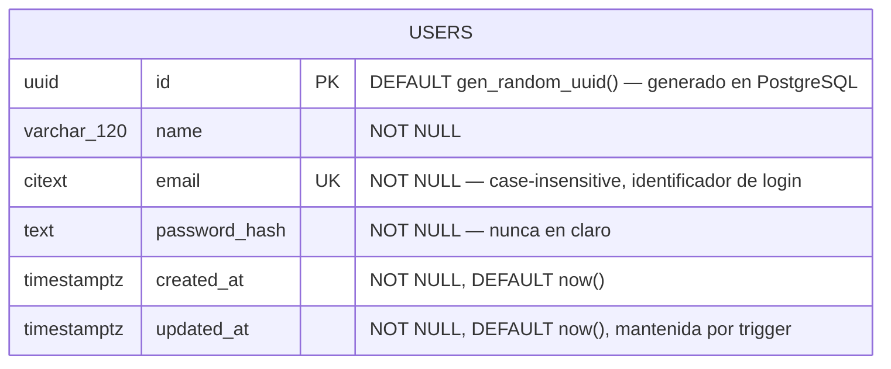

# DATABASE_ERD — Diagrama Entidad-Relación (modelo conceptual)

| Campo | Valor |
|---|---|
| Documento | `docs/architecture/DATABASE_ERD.md` |
| Identificador propuesto | `DB-002` (acompaña a `DB-001` / `DATABASE_ARCHITECTURE.md`) — **pendiente de ratificación** |
| Versión | 0.2 |
| Estado | **Borrador — representa solo el modelo conceptual ratificado hasta hoy** |
| Depende de | `DATABASE_ARCHITECTURE.md` (fuente de verdad directa), `HB-001`, `REPOSITORY_STRUCTURE.md` |
| Idioma | Español (documentación oficial), identificadores/código en inglés |

>  **Este ERD NO es el esquema de PostgreSQL.** Representa el **modelo conceptual aprobado hasta este momento**, no un esquema implementado. Al escribirlo, el backend **no tiene base de datos, ni ORM, ni modelos**: la única entidad ratificada es `users` (`DATABASE_ARCHITECTURE.md` §5). No se implementan tablas, migraciones ni dependencias.

---

## 1. Propósito del ERD

Representar visualmente el modelo conceptual de datos de THERS **ratificado hasta hoy**, para que sirva de referencia compartida antes de implementar PostgreSQL. Su alcance es deliberadamente conservador: dibuja únicamente lo que ya tiene una decisión de persistencia registrada, y deja explícito —sin inventarlo— todo lo que aún debe ratificarse.

---

## 2. Fuente de verdad utilizada

En orden de prioridad para este documento:

1. **`docs/architecture/DATABASE_ARCHITECTURE.md`** — fuente de verdad directa del modelo de datos. Ratifica **una sola entidad** (`users`, §5) y lista el resto como PENDIENTE (§14).
2. **Backend real** (`backend/app/…`) — solo existe el flujo de autenticación (`POST /api/login`) con validación temporal; **no hay modelos ni persistencia**.
3. **Documentación oficial** (`HB-001`, `REPOSITORY_STRUCTURE.md`) — stack (PostgreSQL) y gobernanza (ADR para decisiones de impacto medio/alto).

> El **alcance funcional confirmado por el equipo** (autenticación, perfil, configuración, contenido, interacciones, relaciones sociales, mensajería, notificaciones, seguridad) se toma como **roadmap de producto**, no como modelo de datos ratificado. Ver §8 y la contradicción registrada más abajo.

---

## 3. Diagrama ER (Mermaid)

Solo se dibuja la entidad ratificada. No se dibujan entidades ni relaciones especulativas (reglas 1–4 de esta tarea).

> **Nota sobre el tipo de `id`:** UUID con `DEFAULT gen_random_uuid()` a nivel de PostgreSQL (función nativa desde PostgreSQL 13, sin extensión adicional), implementado en `backend/app/infrastructure/persistence/models.py` y en la migración `a1b2c3d4e5f6_create_users_table.py` (`DATABASE_ARCHITECTURE.md` §5). **Ratificación formal por el Comité Técnico pendiente de confirmar** (`HB-001` §11.1) — decisión indicada directamente por el Tech Lead Backend.
>
> **Nota sobre `email`:** tipo `CITEXT` (extensión `citext` de PostgreSQL, creada por la propia migración) — el `UNIQUE` es case-insensitive a nivel de motor.
>
> **Nota sobre `updated_at`:** actualizada por un trigger de PostgreSQL (`set_updated_at`/`trg_users_updated_at`), no por la capa de aplicación — se mantiene correcta incluso ante `UPDATE`s hechos por SQL directo.

---

## 4. Leyenda de relaciones

Notación de cardinalidad de Mermaid `erDiagram`, para lectura futura cuando existan más entidades:

| Símbolo | Significado |
|---|---|
| `||--||` | uno y solo uno ↔ uno y solo uno |
| `||--o{` | uno ↔ cero o muchos |
| `}o--o{` | cero o muchos ↔ cero o muchos (relación N:N, requiere tabla puente) |
| `||--|{` | uno ↔ uno o muchos |

| Marcador de atributo | Significado |
|---|---|
| `PK` | Clave primaria |
| `FK` | Clave foránea |
| `UK` | Clave única (unicidad a nivel de esquema) |

> **En esta versión no se dibuja ninguna relación**, porque solo hay una entidad ratificada (`users`). La leyenda se incluye para cuando el modelo crezca.

---

## 5. Entidades representadas

| Entidad | Estado | Justificación | Atributos (según `DATABASE_ARCHITECTURE.md` §5) |
|---|---|---|---|
| `users` |  Ratificada | Registro recolecta `name`/`email`/`password`; login autentica por `email`; el backend ya devuelve `{ email, name }` | `id` UUID (PK), `name` VARCHAR(120), `email` CITEXT (UK), `password_hash` TEXT, `created_at`/`updated_at` TIMESTAMPTZ |

**Constraints relevantes de `users`:**
- `email`: **UNIQUE** (case-insensitive, vía `CITEXT`) + **NOT NULL** (login por email; genera el único índice justificado, `DATABASE_ARCHITECTURE.md` §8).
- `name`: **NOT NULL** (el formulario de registro lo exige).
- `password_hash`: **NOT NULL** (nunca se almacena la contraseña en claro).

No se añaden columnas adicionales solo para "completar" el diagrama (regla explícita de esta tarea).

---

## 6. Relaciones principales

**Ninguna en esta versión.** Con una sola entidad ratificada no existen relaciones que representar.

Regla de diseño para cuando existan más entidades (heredada de `DATABASE_ARCHITECTURE.md` §6): las entidades dependientes referenciarán a `users` mediante FK (p. ej. un futuro `posts.author_id → users.id`); las relaciones N:N (follows, participantes de conversación, likes) se modelarán con tablas puente. Nada de esto se dibuja hasta que se ratifique.

---

## 7. Verificación de disciplina del modelo

- El diagrama contiene **exactamente** las entidades y columnas que `DATABASE_ARCHITECTURE.md` ratifica — ni una más.
- No se modeló ninguna entidad "por ser común en redes sociales" (regla 1).
- No se añadieron `username`, `avatar`, `bio`, `phone` a `users` pese a estar en el alcance funcional confirmado, porque `DATABASE_ARCHITECTURE.md` §5 los mantiene PENDIENTES y prohíbe añadirlos por inferencia. Ver contradicción en §8.

---

## 8. PENDIENTES DE APROBACIÓN

El alcance funcional confirmado por el equipo se traduce aquí a **entidades candidatas** que **aún no se modelan** en el diagrama. Cada grupo requiere ratificación como ADR (`HB-001` §11–12) y su incorporación previa a `DATABASE_ARCHITECTURE.md` antes de dibujarse. La lista **no** es un esquema aprobado: es el mapa de lo que falta decidir.

###  Contradicción detectada — no resuelta aquí
El equipo **confirma** un alcance funcional amplio (incluida la sección **PERFIL**: `username`, foto de perfil, biografía). Sin embargo, la fuente de verdad de esta tarea (`DATABASE_ARCHITECTURE.md`) **solo ratifica `users`** con `name/email/password_hash/timestamps`, y su §5 marca `username`/teléfono como **PENDIENTES, a no añadir por inferencia**. Por la jerarquía de fuentes, el ERD **no** los añade y reporta el desajuste. **Acción requerida:** actualizar `DATABASE_ARCHITECTURE.md` vía ADR para incorporar los campos/entidades del alcance confirmado; recién entonces este ERD podrá crecer. **PENDIENTE DE APROBACIÓN.**

### Entidades candidatas por dominio (no modeladas)

| Dominio funcional confirmado | Entidades candidatas (a ratificar) | Nota |
|---|---|---|
| **Autenticación y cuenta** | `oauth_accounts` (login con Google), `email_verifications`, `password_resets`, `account_status`/desactivación | El registro persistente aún no existe en backend |
| **Perfil** | Columnas en `users`: `username` (UK), `avatar_url`, `bio` | ⚠️ Contradice `DATABASE_ARCHITECTURE.md` §5 (ver arriba) |
| **Configuración** | `user_settings` (privacidad, seguridad, preferencias), `notification_preferences`, `blocked_users`, gestión de datos | — |
| **Contenido** | `posts`, `media` (fotos/videos/reels), reglas de `visibility` | La ruta `/feed` es hoy un stub de UI sin entidad |
| **Interacciones** | `reactions`/`likes`, `comments` (auto-referencia para respuestas), `saves`, `mentions`, `hashtags`, `post_hashtags` (puente) | Relaciones N:N requieren tablas puente |
| **Relaciones sociales** | `follows` (N:N auto-referencial), `blocks`, `restrictions` | Política `ON DELETE` a decidir por relación |
| **Mensajería** | `conversations`, `conversation_participants` (puente), `messages`, `message_media`, estado leído/no leído | — |
| **Notificaciones** | `notifications` | Referenciaría a `users` y a la entidad origen |
| **Seguridad** | `sessions`, `devices`, `password_changes` (historial), `security_events`/auditoría | JWT es hoy stateless; ninguna sesión se persiste aún |

### Decisiones transversales pendientes (heredadas de `DATABASE_ARCHITECTURE.md` §14)
- Para `users` ya resuelto (ver §5 de este documento): tipo de PK (UUID), normalización de `email` (`CITEXT`). **Todavía pendiente para las entidades candidatas de esta tabla:** si heredan el mismo patrón (UUID, `CITEXT` donde aplique) o se decide caso por caso; longitudes de columnas, algoritmo de hashing, estrategia de enums.
- Versión de PostgreSQL: **PostgreSQL 16** vía Docker Compose (`docker-compose.yml`, raíz del repo, imagen `postgres:16-alpine`), entorno de desarrollo local reproducible verificado end-to-end (`DATABASE_ARCHITECTURE.md` §14); driver/ORM ya resueltos (SQLAlchemy + psycopg v3, `BACKEND_ARCHITECTURE.md` §2); herramienta de migraciones ya resuelta (Flask-Migrate/Alembic); backups, variables de entorno, roles de acceso siguen pendientes.

---

## 9. Cierre

Este ERD **no modifica** backend, Frontend, Handbook ni instala dependencias: documenta el modelo conceptual ratificado (una entidad, `users`) y registra explícitamente todo lo pendiente. Crecerá a medida que el alcance funcional confirmado se traduzca en decisiones de persistencia ratificadas en `DATABASE_ARCHITECTURE.md` (ADR, `HB-001` §11–12), no antes.
