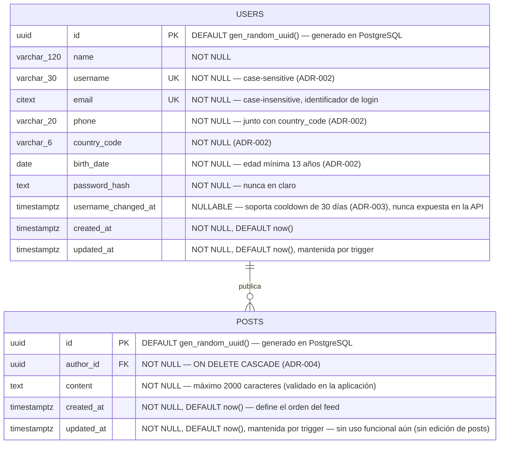

# DATABASE_ERD — Diagrama Entidad-Relación (modelo conceptual)

| Campo | Valor |
|---|---|
| Documento | `docs/architecture/DATABASE_ERD.md` |
| Identificador propuesto | `DB-002` (acompaña a `DB-001` / `DATABASE_ARCHITECTURE.md`) — **pendiente de ratificación** |
| Versión | 0.4 |
| Estado | **Borrador — representa solo el modelo conceptual ratificado hasta hoy** |
| Depende de | `DATABASE_ARCHITECTURE.md` (fuente de verdad directa), `HB-001`, `REPOSITORY_STRUCTURE.md` |
| Idioma | Español (documentación oficial), identificadores/código en inglés |

>  **Este ERD NO es el esquema de PostgreSQL.** Representa el **modelo conceptual aprobado hasta este momento**, no un esquema implementado 1:1 (aunque en esta versión coincide con él, ver nota v0.3). Las entidades ratificadas hoy son `users` y `posts` (`DATABASE_ARCHITECTURE.md` §5). No se implementan tablas, migraciones ni dependencias desde este documento.
>
> **v0.4 — primera relación real del modelo (`ADR-004-posts-minimal-model.md`).** `posts` pasa de candidata objetivo a ratificada (`DATABASE_ARCHITECTURE.md` §4.A/§5.2, v0.8) — se agrega al diagrama (§3) junto con la primera relación entre entidades que este ERD dibuja (`users ||--o{ posts`). Reflejado en §3, §4, §5, §6, §7, §8.
>
> **v0.3 — auditoría documental integral de THERS (sincronización, sin cambios de esquema).** Este ERD seguía dibujando solo las 5 columnas de la migración inicial (`id`, `name`, `email`, `password_hash`, `created_at`/`updated_at`), sin `username`/`phone`/`country_code`/`birth_date` (ratificadas por `ADR-002-user-profile-fields.md`, `DATABASE_ARCHITECTURE.md` v0.5) ni `username_changed_at` (ratificada por `ADR-003-profile-update-contract.md`, `DATABASE_ARCHITECTURE.md` v0.6) — quedó desactualizado dos ratificaciones por detrás de su propia fuente de verdad (§2 de este documento). La "contradicción detectada" que §8 registraba (username/teléfono confirmados en el alcance funcional pero no dibujados) ya no aplica: `username`/`phone`/`country_code`/`birth_date` migraron de candidatos a ratificados: se corrige el diagrama (§3) y §7/§8 más abajo. `avatar_url`/`bio` siguen sin ratificar y **no** se agregan aquí.

---

## 1. Propósito del ERD

Representar visualmente el modelo conceptual de datos de THERS **ratificado hasta hoy**, para que sirva de referencia compartida antes de implementar PostgreSQL. Su alcance es deliberadamente conservador: dibuja únicamente lo que ya tiene una decisión de persistencia registrada, y deja explícito —sin inventarlo— todo lo que aún debe ratificarse.

---

## 2. Fuente de verdad utilizada

En orden de prioridad para este documento:

1. **`docs/architecture/DATABASE_ARCHITECTURE.md`** — fuente de verdad directa del modelo de datos. Ratifica **una sola entidad** (`users`, §5) y lista el resto como PENDIENTE (§14).
2. **Backend real** (`backend/app/…`) — solo existe el flujo de autenticación (`POST /api/login`) con validación temporal; **no hay modelos ni persistencia**.
3. **Documentación oficial** (`HB-001`, `REPOSITORY_STRUCTURE.md`) — stack (PostgreSQL) y gobernanza (ADR para decisiones de impacto medio/alto).

> El **alcance funcional confirmado por el equipo** (autenticación, perfil, configuración, contenido, interacciones, relaciones sociales, mensajería, notificaciones, seguridad) se toma como **roadmap de producto**, no como modelo de datos ratificado. Ver §8 y la contradicción registrada más abajo.

---

## 3. Diagrama ER (Mermaid)

Solo se dibuja la entidad ratificada. No se dibujan entidades ni relaciones especulativas (reglas 1–4 de esta tarea).

> **Nota sobre el tipo de `id`:** UUID con `DEFAULT gen_random_uuid()` a nivel de PostgreSQL (función nativa desde PostgreSQL 13, sin extensión adicional), implementado en `backend/app/infrastructure/persistence/models.py` y en la migración `a1b2c3d4e5f6_create_users_table.py` (`DATABASE_ARCHITECTURE.md` §5). **Ratificación formal por el Comité Técnico pendiente de confirmar** (`HB-001` §11.1) — decisión indicada directamente por el Tech Lead Backend.
>
> **Nota sobre `username`/`phone`/`country_code`/`birth_date` (v0.3, `ADR-002-user-profile-fields.md`):** `username` es **case-sensitive** (a diferencia de `email`) — decisión explícita, ningún flujo hoy requiere comparación case-insensitive. `phone`/`country_code` representan un único dato lógico (teléfono internacional) y no llevan constraint de unicidad. `birth_date` se valida con edad mínima de 13 años en el backend (`domain/auth/validators.py`).
>
> **Nota sobre `email`:** tipo `CITEXT` (extensión `citext` de PostgreSQL, creada por la propia migración) — el `UNIQUE` es case-insensitive a nivel de motor.
>
> **Nota sobre `username_changed_at` (v0.3, `ADR-003-profile-update-contract.md`):** sostiene el cooldown de 30 días entre cambios de `username` vía `PATCH /api/users/me` (`domain/auth/username_policy.py`). `NULL` significa "nunca cambió su username". Es un dato **interno** — nunca cruza la frontera HTTP (`API_CONTRACT.md` §5), por eso no se expone junto a las demás columnas en ningún endpoint público.
>
> **Nota sobre `updated_at`:** actualizada por un trigger de PostgreSQL (`set_updated_at`/`trg_users_updated_at`), no por la capa de aplicación — se mantiene correcta incluso ante `UPDATE`s hechos por SQL directo.
>
> **Nota sobre `POSTS` (v0.4, `ADR-004-posts-minimal-model.md`):** primera entidad y primera relación (`users ||--o{ posts`, "publica") que este ERD dibuja más allá de `users`. Deliberadamente mínima — sin `visibility`, `mood`, hashtags, medios, reacciones ni comentarios; cada uno es su propia entidad candidata (§8) a resolver en un ADR futuro y acotado. `author_id` reutiliza la función `set_updated_at()` ya creada por la migración inicial de `users` — no se duplica.

---

## 4. Leyenda de relaciones

Notación de cardinalidad de Mermaid `erDiagram`, para lectura futura cuando existan más entidades:

| Símbolo | Significado |
|---|---|
| `||--||` | uno y solo uno ↔ uno y solo uno |
| `||--o{` | uno ↔ cero o muchos |
| `}o--o{` | cero o muchos ↔ cero o muchos (relación N:N, requiere tabla puente) |
| `||--|{` | uno ↔ uno o muchos |

| Marcador de atributo | Significado |
|---|---|
| `PK` | Clave primaria |
| `FK` | Clave foránea |
| `UK` | Clave única (unicidad a nivel de esquema) |

> **v0.4 — primera relación dibujada:** `USERS ||--o{ POSTS` ("uno ↔ cero o muchos") — un usuario puede tener cero o muchos posts; cada post tiene exactamente un autor. La leyenda se mantiene para cuando el modelo siga creciendo.

---

## 5. Entidades representadas

| Entidad | Estado | Justificación | Atributos (según `DATABASE_ARCHITECTURE.md` §5) |
|---|---|---|---|
| `users` |  Ratificada | Registro persiste `name`/`username`/`email`/`phone`/`country_code`/`birth_date`/`password`; login autentica por `email`; `GET`/`PATCH /api/users/me` leen y actualizan el mismo registro | `id` UUID (PK), `name` VARCHAR(120), `username` VARCHAR(30) (UK), `email` CITEXT (UK), `phone` VARCHAR(20), `country_code` VARCHAR(6), `birth_date` DATE, `password_hash` TEXT, `username_changed_at` TIMESTAMPTZ (nullable, interna), `created_at`/`updated_at` TIMESTAMPTZ |
| `posts` |  Ratificada — v0.4 | `POST`/`GET /api/posts` crean y listan posts de texto reales, respaldados por PostgreSQL (`ADR-004-posts-minimal-model.md`) | `id` UUID (PK), `author_id` UUID (FK → `users.id`), `content` TEXT, `created_at`/`updated_at` TIMESTAMPTZ |

**Constraints relevantes de `users`:**
- `email`: **UNIQUE** (case-insensitive, vía `CITEXT`) + **NOT NULL** (login por email; genera un índice justificado, `DATABASE_ARCHITECTURE.md` §8).
- `username`: **UNIQUE** (`uq_users_username`, case-sensitive) + **NOT NULL** (`ADR-002`; genera el otro índice justificado, `DATABASE_ARCHITECTURE.md` §8).
- `name`, `phone`, `country_code`, `birth_date`: **NOT NULL** (el formulario de registro los exige; formato validado en el backend).
- `password_hash`: **NOT NULL** (nunca se almacena la contraseña en claro).
- `username_changed_at`: nullable — soporta el cooldown de 30 días de `PATCH /api/users/me` (`ADR-003`), no forma parte del contrato HTTP público.

No se añaden columnas adicionales solo para "completar" el diagrama (regla explícita de esta tarea).

---

## 6. Relaciones principales

**v0.4 — primera relación real:** `users (1) ←→ (N) posts` (`posts.author_id → users.id`, `ON DELETE CASCADE`) — `ADR-004-posts-minimal-model.md`.

Regla de diseño para cuando existan más entidades (heredada de `DATABASE_ARCHITECTURE.md` §6): las entidades dependientes referenciarán a `users` o a `posts` mediante FK (p. ej. un futuro `reactions.post_id`); las relaciones N:N (follows, participantes de conversación, likes) se modelarán con tablas puente. Nada de esto se dibuja hasta que se ratifique.

---

## 7. Verificación de disciplina del modelo

- El diagrama contiene **exactamente** las entidades y columnas que `DATABASE_ARCHITECTURE.md` ratifica — ni una más.
- No se modeló ninguna entidad "por ser común en redes sociales" (regla 1).
- `username`, `phone`, `country_code`, `birth_date` (`ADR-002-user-profile-fields.md`) y `username_changed_at` (`ADR-003-profile-update-contract.md`) se dibujan desde v0.3 — dejaron de ser candidatos objetivo (§4.B) para pasar a ratificados (§5). `posts` (v0.4, `ADR-004-posts-minimal-model.md`) es la primera entidad *distinta* de `users` y la primera relación real que este ERD dibuja — deliberadamente sin `visibility`/medios/reacciones/comentarios, cada uno sigue como candidata (§8). `avatar_url`/`bio` siguen sin ratificar y **no** se añaden por inferencia.

---

## 8. PENDIENTES DE APROBACIÓN

El alcance funcional confirmado por el equipo se traduce aquí a **entidades candidatas** que **aún no se modelan** en el diagrama. Cada grupo requiere ratificación como ADR (`HB-001` §11–12) y su incorporación previa a `DATABASE_ARCHITECTURE.md` antes de dibujarse. La lista **no** es un esquema aprobado: es el mapa de lo que falta decidir.

### Contradicción histórica — cerrada en v0.3
Versiones anteriores de este documento (hasta v0.2) registraban aquí una contradicción: el alcance funcional confirmaba `username`/teléfono en **PERFIL**, pero `DATABASE_ARCHITECTURE.md` solo ratificaba `name/email/password_hash/timestamps` y marcaba esas columnas como pendientes de ADR. `ADR-002-user-profile-fields.md` (`username`/`phone`/`country_code`/`birth_date`) y `ADR-003-profile-update-contract.md` (`username_changed_at`) resolvieron exactamente esa pendiente — el diagrama (§3) ya las incorpora. `avatar_url`/`bio` (mismo bloque **PERFIL**) siguen sin su propio ADR y **no** se dibujan todavía.

### Entidades candidatas por dominio (no modeladas)

| Dominio funcional confirmado | Entidades candidatas (a ratificar) | Nota |
|---|---|---|
| **Autenticación y cuenta** | `oauth_accounts` (login con Google), `email_verifications`, `password_resets`, `account_status`/desactivación | El registro persistente aún no existe en backend |
| **Perfil** | Columnas en `users`: `avatar_url`, `bio` (`username`/`phone`/`country_code`/`birth_date` ya ratificadas, ver §3/§5) | Pendiente de ADR propio — no cubiertas por `ADR-002` ni `ADR-003` |
| **Configuración** | `user_settings` (privacidad, seguridad, preferencias), `notification_preferences`, `blocked_users`, gestión de datos | — |
| **Contenido** | ~~`posts`~~ — **ratificada v0.4** (solo texto, ver §3/§5); `media` (fotos/videos/reels), reglas de `visibility` siguen candidatas | La ruta `/feed` en el Frontend todavía no consume `posts` real — sigue mostrando datos mock (`mockCapsules`) |
| **Interacciones** | `reactions`/`likes`, `comments` (auto-referencia para respuestas), `saves`, `mentions`, `hashtags`, `post_hashtags` (puente) | Relaciones N:N requieren tablas puente |
| **Relaciones sociales** | `follows` (N:N auto-referencial), `blocks`, `restrictions` | Política `ON DELETE` a decidir por relación |
| **Mensajería** | `conversations`, `conversation_participants` (puente), `messages`, `message_media`, estado leído/no leído | — |
| **Notificaciones** | `notifications` | Referenciaría a `users` y a la entidad origen |
| **Seguridad** | `sessions`, `devices`, `password_changes` (historial), `security_events`/auditoría | JWT es hoy stateless; ninguna sesión se persiste aún |

### Decisiones transversales pendientes (heredadas de `DATABASE_ARCHITECTURE.md` §14)
- Para `users` ya resuelto (ver §5 de este documento): tipo de PK (UUID), normalización de `email` (`CITEXT`). **Todavía pendiente para las entidades candidatas de esta tabla:** si heredan el mismo patrón (UUID, `CITEXT` donde aplique) o se decide caso por caso; longitudes de columnas, algoritmo de hashing, estrategia de enums.
- Versión de PostgreSQL: **PostgreSQL 16** vía Docker Compose (`docker-compose.yml`, raíz del repo, imagen `postgres:16-alpine`), entorno de desarrollo local reproducible verificado end-to-end (`DATABASE_ARCHITECTURE.md` §14); driver/ORM ya resueltos (SQLAlchemy + psycopg v3, `BACKEND_ARCHITECTURE.md` §2); herramienta de migraciones ya resuelta (Flask-Migrate/Alembic); backups, variables de entorno, roles de acceso siguen pendientes.

---

## 9. Cierre

Este ERD **no modifica** backend, Frontend, Handbook ni instala dependencias: documenta el modelo conceptual ratificado (una entidad, `users`) y registra explícitamente todo lo pendiente. Crecerá a medida que el alcance funcional confirmado se traduzca en decisiones de persistencia ratificadas en `DATABASE_ARCHITECTURE.md` (ADR, `HB-001` §11–12), no antes.
