# DATABASE_ERD_OBJETIVO — ERD del producto objetivo (propuesta candidata)

| Campo | Valor |
|---|---|
| Documento | `docs/architecture/DATABASE_ERD_OBJETIVO.md` |
| Identificador propuesto | `DB-003` (acompaña a `DB-001`/`DATABASE_ARCHITECTURE.md` y `DB-002`/`DATABASE_ERD.md`) — **pendiente de ratificación** |
| Versión | 0.2 |
| Estado | **Borrador — PROPUESTA CANDIDATA, no ratificada** |
| Depende de | `DATABASE_ARCHITECTURE.md` §4.B (fuente directa), `HB-001` §11–12 (ADR) |
| Idioma | Español (documentación oficial), identificadores/código en inglés |

>  **Esto NO es el esquema de PostgreSQL ni un modelo ratificado.** Es la **visualización de las estructuras candidatas** de la *arquitectura objetivo del producto* (`DATABASE_ARCHITECTURE.md` §4.B). Cada entidad, columna, PK, FK y cardinalidad que aparece aquí es una **hipótesis a ratificar por ADR** (`HB-001` §11–12), no una decisión tomada. No se implementa nada a partir de este documento.

---

## 1. Propósito del ERD objetivo

Dar una vista de conjunto —navegable de un vistazo— de cómo *podrían* relacionarse las estructuras de datos que cubren el alcance funcional confirmado de THERS, para facilitar la discusión de modelado del equipo. Su función es **preparar la conversación de ratificación**, no adelantarla.

---

## 2. Relación con los otros documentos de datos

| Documento | Qué representa | Estado |
|---|---|---|
| `DATABASE_ERD.md` (DB-002) | **Modelo ratificado actual** — solo `users` (capa 4.A) | Vigente, **no se toca** |
| `DATABASE_ERD_OBJETIVO.md` (este) | **Modelo objetivo candidato** — capa 4.B traducida a diagrama | Propuesta, no ratificada |
| `DATABASE_ARCHITECTURE.md` (DB-001) | Contrato y fuente de verdad de ambas capas | §4.B es la fuente directa de este ERD |

Este documento **no reemplaza** a `DATABASE_ERD.md`: coexisten. Cuando una parte del objetivo se ratifique por ADR, migrará del "candidato" (aquí) al "ratificado" (`DATABASE_ERD.md`).

---

## 3. Fuente de verdad utilizada

1. **`DATABASE_ARCHITECTURE.md` §4.B** — cada entidad/forma candidata proviene literalmente de ahí; no se añade ninguna que no esté en §4.B.
2. **`DATABASE_ARCHITECTURE.md` §6, §7** — reglas de diseño (dependientes referencian a `users`; convención de PK/FK/nombres, aún propuestas).
3. **Alcance funcional confirmado por el equipo** — el *qué*, no el *cómo*.

No se consultó ninguna red social externa como referencia de estructura (regla: no asumir un modelo "típico").

---

## 4. Advertencias de lectura (importantes)

- **Tipos neutrales.** Se usa `identifier` para claves y tipos genéricos (`string`, `text`, `enum`, `boolean`, `timestamptz`). **No** se afirma BIGINT vs UUID ni longitudes — esa decisión sigue PENDIENTE (`DATABASE_ARCHITECTURE.md` §14).
- **Convención omitida por legibilidad.** Toda entidad llevaría `id` (PK) y `created_at`/`updated_at` por convención (§7). En el diagrama se muestra `id PK` pero **se omiten los timestamps** para no repetirlos 20 veces; se dan por incluidos.
- **Solo atributos que definen la entidad.** No se listan todas las columnas (regla: no añadir columnas innecesarias). Se muestran PK, las FK y el atributo discriminante imprescindible (p. ej. `reactions.type`, `posts.visibility`).
- **Dos grados de firmeza.** Las entidades marcadas **[FORMA PENDIENTE]** están dibujadas como **una sola** hipótesis (p. ej. `media` como entidad) únicamente para poder visualizarlas; §4.B mantiene abierta su forma (entidad vs columna vs JSON vs evento). Ver §8.

---

## 5. Diagrama ER objetivo (Mermaid)

```mermaid
erDiagram
    USERS {
        identifier id PK
        string email UK
        string username UK "OBJETIVO"
        string name
        string avatar_url "FORMA PENDIENTE: columna vs entidad media"
        string password_hash
    }

    OAUTH_ACCOUNTS {
        identifier id PK
        identifier user_id FK
        string provider "google"
    }

    SESSIONS {
        identifier id PK
        identifier user_id FK
        identifier device_id FK "nullable"
    }

    DEVICES {
        identifier id PK
        identifier user_id FK
    }

    SECURITY_EVENTS {
        identifier id PK
        identifier user_id FK
        string type
    }

    PASSWORD_CHANGES {
        identifier id PK
        identifier user_id FK
    }

    USER_SETTINGS {
        identifier id PK
        identifier user_id FK
    }

    POSTS {
        identifier id PK
        identifier author_id FK
        enum visibility "OBJETIVO"
    }

    MEDIA {
        identifier id PK
        identifier post_id FK "nullable"
        string type "image/video/reel — pendiente"
    }

    REACTIONS {
        identifier id PK
        identifier user_id FK
        identifier post_id FK
        string type "like/reaccion"
    }

    COMMENTS {
        identifier id PK
        identifier post_id FK
        identifier author_id FK
        identifier parent_comment_id FK "nullable — respuestas"
    }

    SAVES {
        identifier id PK
        identifier user_id FK
        identifier post_id FK
    }

    MENTIONS {
        identifier id PK
        identifier mentioned_user_id FK
        identifier post_id FK "origen — pendiente"
    }

    HASHTAGS {
        identifier id PK
        string tag UK
    }

    POST_HASHTAGS {
        identifier post_id FK
        identifier hashtag_id FK
    }

    FOLLOWS {
        identifier id PK
        identifier follower_id FK
        identifier followed_id FK
    }

    BLOCKS {
        identifier id PK
        identifier blocker_id FK
        identifier blocked_id FK
    }

    RESTRICTIONS {
        identifier id PK
        identifier user_id FK
        identifier restricted_id FK
    }

    CONVERSATIONS {
        identifier id PK
        boolean is_group
    }

    CONVERSATION_PARTICIPANTS {
        identifier id PK
        identifier conversation_id FK
        identifier user_id FK
        timestamptz last_read_at "estado leido — forma pendiente"
    }

    MESSAGES {
        identifier id PK
        identifier conversation_id FK
        identifier sender_id FK
    }

    MESSAGE_MEDIA {
        identifier id PK
        identifier message_id FK
    }

    NOTIFICATIONS {
        identifier id PK
        identifier recipient_id FK
        string type "like/comment/follow/mention/message"
    }

    USERS ||--o{ OAUTH_ACCOUNTS : "vincula"
    USERS ||--o{ SESSIONS : "inicia"
    USERS ||--o{ DEVICES : "registra"
    DEVICES ||--o{ SESSIONS : "desde"
    USERS ||--o{ SECURITY_EVENTS : "genera"
    USERS ||--o{ PASSWORD_CHANGES : "historial"
    USERS ||--o| USER_SETTINGS : "configura"

    USERS ||--o{ POSTS : "autor"
    POSTS ||--o{ MEDIA : "contiene"
    POSTS ||--o{ REACTIONS : "recibe"
    USERS ||--o{ REACTIONS : "reacciona"
    POSTS ||--o{ COMMENTS : "tiene"
    USERS ||--o{ COMMENTS : "escribe"
    COMMENTS ||--o{ COMMENTS : "responde"
    POSTS ||--o{ SAVES : "guardado"
    USERS ||--o{ SAVES : "guarda"
    POSTS ||--o{ MENTIONS : "origen"
    USERS ||--o{ MENTIONS : "mencionado"
    POSTS ||--o{ POST_HASHTAGS : "etiqueta"
    HASHTAGS ||--o{ POST_HASHTAGS : "agrupa"

    USERS ||--o{ FOLLOWS : "follower"
    USERS ||--o{ FOLLOWS : "followed"
    USERS ||--o{ BLOCKS : "blocker"
    USERS ||--o{ BLOCKS : "blocked"
    USERS ||--o{ RESTRICTIONS : "restrictor"
    USERS ||--o{ RESTRICTIONS : "restricted"

    CONVERSATIONS ||--o{ CONVERSATION_PARTICIPANTS : "incluye"
    USERS ||--o{ CONVERSATION_PARTICIPANTS : "participa"
    CONVERSATIONS ||--o{ MESSAGES : "contiene"
    USERS ||--o{ MESSAGES : "envia"
    MESSAGES ||--o{ MESSAGE_MEDIA : "adjunta"

    USERS ||--o{ NOTIFICATIONS : "recibe"
```

---

## 6. Leyenda

**Cardinalidades (Mermaid):** `||--o{` = uno a cero-o-muchos · `||--o|` = uno a cero-o-uno (1:1 opcional) · una relación N:N siempre pasa por una **tabla puente** (p. ej. `follows`, `post_hashtags`, `conversation_participants`).

**Marcadores de atributo:** `PK` clave primaria (candidata) · `FK` clave foránea (candidata) · `UK` clave única.

**Convenciones no dibujadas** (§7 de DB-001, aún propuestas): todo `id PK` es una **PK sustituta candidata**; para las tablas puente, elegir **PK sustituta vs PK compuesta** es una decisión abierta. Los `created_at`/`updated_at` se omiten pero se asumen en cada entidad.

---

## 7. Entidades representadas (todas candidatas)

| Entidad | Estado en §4.B | Propósito | Colapsa (regla "1 feature ≠ 1 tabla") |
|---|---|---|---|
| `users` | **RATIFICADA + columnas OBJETIVO** | Cuenta y perfil | username/bio/avatar como columnas objetivo |
| `oauth_accounts` | **[FORMA PENDIENTE]** | Login con Google | — |
| `sessions` / `devices` | OBJETIVO | Sesiones y dispositivos | Auth + Configuración + Seguridad → mismas 2 entidades |
| `security_events` | **[FORMA PENDIENTE]** | Auditoría condicional | — |
| `password_changes` | **[FORMA PENDIENTE]** | Historial de contraseña | — |
| `user_settings` | **[FORMA PENDIENTE]** | Configuración | Cuenta/Privacidad/Seguridad/Notif./Preferencias → 1 estructura (o columnas/JSON) |
| `posts` | OBJETIVO | Publicaciones | Editar/eliminar/visibilidad = columnas+comportamiento |
| `media` | **[FORMA PENDIENTE]** | Fotos/videos/reels | 3 tipos de contenido → 1 entidad con `type` |
| `reactions` | OBJETIVO | Likes/reacciones | Like + reacción → 1 entidad con `type` |
| `comments` | OBJETIVO | Comentarios y respuestas | Comentario + respuesta → 1 entidad auto-referencial |
| `saves` | OBJETIVO | Guardar publicaciones | — |
| `mentions` | **[FORMA PENDIENTE]** | Menciones | Persistir vs derivar en render |
| `hashtags` + `post_hashtags` | OBJETIVO | Hashtags | Puente N:N |
| `follows` | OBJETIVO | Relaciones sociales | Seguir/dejar/seguidores/seguidos → 1 puente |
| `blocks` | OBJETIVO | Bloqueo | — |
| `restrictions` | **[FORMA PENDIENTE]** | Restringir | Semántica vs bloqueo por definir |
| `conversations` + `conversation_participants` + `messages` | OBJETIVO | Mensajería (1:1 y grupal) | Privadas + grupales → misma estructura |
| `message_media` | **[FORMA PENDIENTE]** | Media en mensajes | Reutilizar `media` vs entidad propia |
| `notifications` | OBJETIVO | Notificaciones | Todos los tipos → 1 entidad con `type` |

---

## 8. Decisiones de forma NO resueltas que afectan el dibujo

Estas estructuras están dibujadas como **una** hipótesis solo para visualizar; su forma real sigue abierta (`DATABASE_ARCHITECTURE.md` §4.B):

- **`oauth_accounts`** — entidad separada **vs** columnas de proveedor en `users`.
- **`user_settings`** — tabla 1:1 **vs** columnas en `users` **vs** documento JSON.
- **`media` / `message_media`** — una tabla de medios con `type` **vs** tablas separadas **vs** columnas; ¿"reel" es un `type` de video o entidad propia?; ¿`message_media` reutiliza `media`?
- **`avatar_url`** — columna en `users` **vs** referencia a `media`.
- **`mentions`** — persistir como puente **vs** derivar en tiempo de lectura (no persistir).
- **Estado leído/no leído** — `last_read_at` en participante (dibujado) **vs** tabla `message_reads` por mensaje.
- **`restrictions`** — tabla puente **vs** atributo de la relación social.
- **`security_events` / `password_changes`** — solo si se requiere auditoría/historial (condicional).
- **Verificación de correo / recuperación de contraseña** — tabla de tokens **vs** columnas **vs** servicio externo → **por eso NO se dibujan** como entidad (forma demasiado abierta).
- **Compartir publicaciones** — entidad de repost **vs** evento **vs** externo → **no se dibuja**.
- **Desactivación/eliminación de cuenta** — columna de estado/borrado lógico en `users` **vs** borrado físico → no se dibuja como estructura propia.

---

## 9. PENDIENTES DE APROBACIÓN

- **Modelado de cada entidad candidata:** tipo de PK (sustituta vs compuesta en puentes), tipos SQL, FK y políticas `ON DELETE`, enums, índices — todo PENDIENTE (`DATABASE_ARCHITECTURE.md` §4.C, §14).
- **Resolución de las formas abiertas** de §8 (cada una, un ADR).
- **Ratificación por dominio:** cada bloque funcional debe aprobarse como ADR (`HB-001` §11–12) antes de migrar de este ERD candidato a `DATABASE_ERD.md` (ratificado).
- **Motor/operación:** versión de PostgreSQL, driver/ORM, migraciones, backups, variables de entorno, roles (§14 de DB-001).

---

## 10. Verificación de disciplina

- **No se añadió ninguna entidad ausente de §4.B.** Cada estructura del diagrama tiene su origen en la capa objetivo del contrato.
- **No se decidió el modelado:** tipos neutrales, PK/FK marcados como candidatos, formas abiertas señaladas en §8.
- **No se convirtió cada feature en tabla:** likes+reacciones, comentarios+respuestas, seguir/seguidores, notificaciones, conversaciones privadas+grupales, y fotos/videos/reels colapsan en estructuras únicas (§7).
- **No se tocó `DATABASE_ERD.md`** (modelo ratificado) ni ningún otro archivo.

---

## 11. Cierre

Este ERD objetivo es un **insumo de diseño**, no un compromiso de esquema. Vive en paralelo al ERD ratificado (`DATABASE_ERD.md`, solo `users`) y solo crecerá el modelo ratificado cuando cada parte se apruebe por ADR e ingrese a `DATABASE_ARCHITECTURE.md`. Hasta entonces, **nada de aquí se implementa**.
